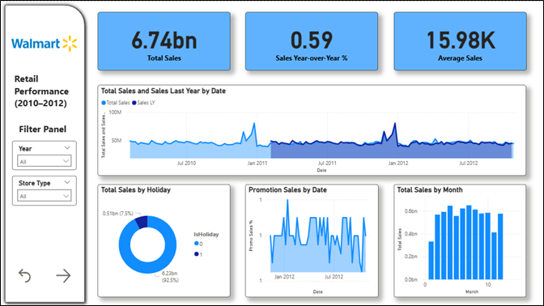

# Walmart Sales Analytics (Python & Power BI)

This project demonstrates an end-to-end Business Intelligence workflow using Walmart retail sales data, from data cleaning with Python to interactive dashboard development in Power BI.

## Overview
The goal of this project is to transform raw Walmart sales data into meaningful insights. Python is used to clean and preprocess the raw dataset, producing a new analysis-ready file that is later imported into Power BI for data modeling and visualization.

## Workflow
1. Raw Walmart sales data is cleaned and processed using Python in Visual Studio Code.
2. The Python script generates a new cleaned CSV file.
3. The cleaned data is imported into Power BI.
4. A star schema data model is created.
5. Interactive dashboards are developed to analyze sales performance.

## Tools Used
- Python (Pandas, NumPy) – Data cleaning and preprocessing
- Visual Studio Code – Python development environment
- Power BI – Data modeling, DAX measures, and dashboard visualization

## Features
- Cleaned and consolidated Walmart sales dataset (2010–2012).
- Star schema model for efficient analysis.
- Sales analysis by store, department, and time.
- Holiday and promotion impact insights.
- Interactive Power BI dashboard with slicers and rankings.

## Usage
1. Run the Python script to generate the cleaned dataset.
2. Load the cleaned CSV file into Power BI.
3. Explore the dashboard using filters and interactive visuals.

---

